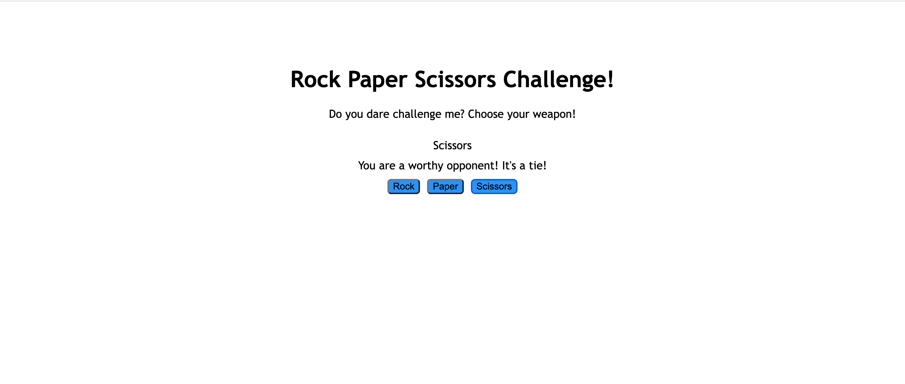

# Rock_Paper_Scissors
JavaScript Project - A Rock Paper Scissors game!

### This is my first project using JavaScript.

This project was completed as an assignment for The Odin Project intro to JavaScript course.The aim of the assignment was to build a game with JavaScript with simple CSS styling and basic HTML.

## Built With 

- HTML5
- CSS3
- JavaScript

## Prerequisites

You will need a web browser to view this project. No set up required. Works best on:

- Firefox
- Google Chrome
- Safari

## Live Demo

<https://raybgomez.github.io/Rock_Paper_Scissors/>

Deployed on [GitHub Pages](https://pages.github.com/) 

### Usage

Click on the above live demo link to view the page.
**Step 1** You will see three blue buttons labeled "Rock, Paper and Scissors".
**Step 2** Click one the weapon of your choice, rock paper or scissors.
**Step 3** Your opponent, the computer, will generate it's choice and reveal whether you've won or lost.

## Acknowledgement

Introduction to JavaScript lesson by [The Odin Project](https://www.theodinproject.com) 

## Contributing

Contributions, issues, and feature requests are welcome!

## Show your support

Show your love by hitting the ⭐️ button, I'd really appreciate it.
